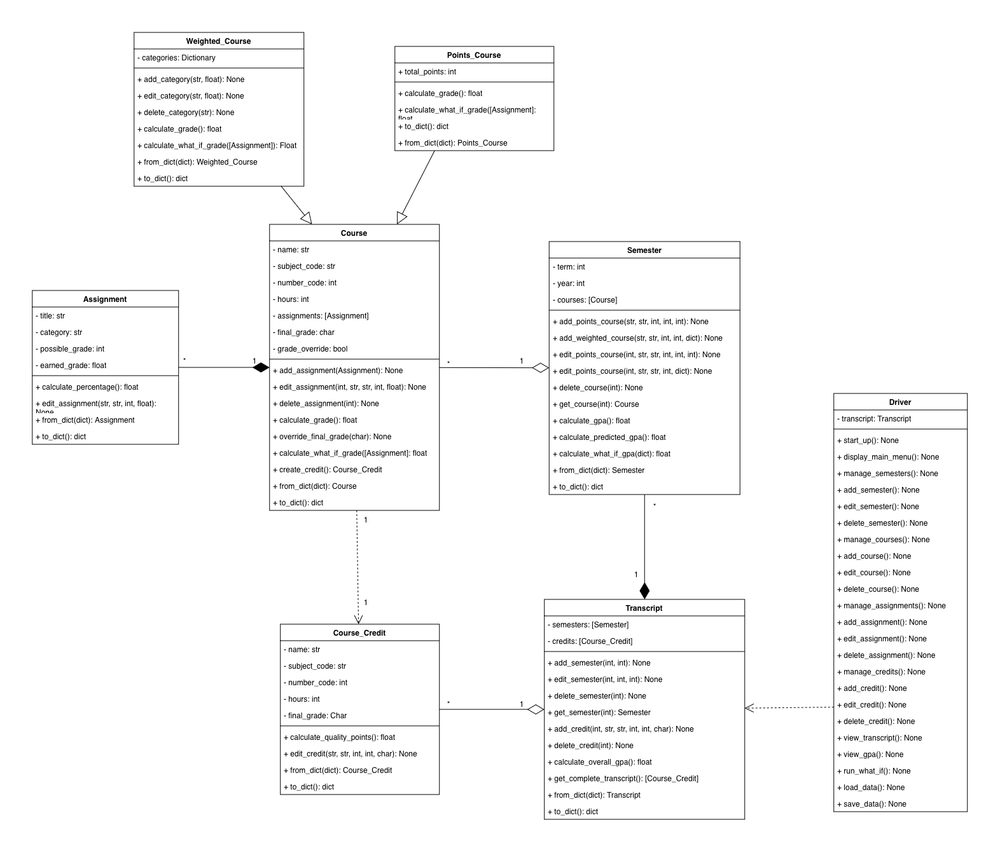

# GradePoint

## Program Description

GradePoint is a grade and GPA tracking program for college students. It allows students to organize their academic information by semester and course and track their progress throughout a semester.

The program supports both points-based and weighted courses. Students can enter assignments and grades to calculate their current course grades, predict how future grades could affect their results, and calculate semester and overall GPAs. Students can also view a transcript of completed courses and their final grades.

A complete list of planned features is outlined in `user_stories.md`.

### High-Level Features

- Add, edit, and remove semesters
- Add, edit, and remove courses
- Support points-based and weighted grading
- Add, edit, and remove assignments
- Calculate current course grades
- Override calculated final grades
- Calculate semester and overall GPA
- Predict grades using hypothetical scores
- View completed courses in a transcript
- Save data between uses

## Data

GradePoint manages several related types of academic data. A **transcript** contains the student's semesters and academic history. Each **semester** contains the courses taken during that term. Courses may use either a **points-based** or **weighted** grading structure and contain the **assignments** used to calculate the course grade. **Course credits** represent completed course information used for transcript and GPA calculations.

The dataset includes multiple semesters, courses, grading structures, and assignments to provide enough variety to develop and test GradePoint's planned functionality.

### Data Excerpt

```json
{
  "semesters": [
    {
      "term": "Fall",
      "year": 2024,
      "courses": [
        {
          "name": "Introduction to Programming",
          "subject_code": "CSC",
          "number_code": 1200,
          "hours": 3,
          "final_grade": "A",
          "grading_type": "points",
          "total_points": 100,
          "assignments": [
            {
              "title": "Program 1",
              "category": "Programs",
              "possible_grade": 100,
              "earned_grade": 94
            }
          ]
        },
        {
          "name": "Calculus I",
          "subject_code": "MATH",
          "number_code": 1910,
          "hours": 4,
          "final_grade": "B",
          "grading_type": "weighted",
          "categories": {
            "Homework": 0.20,
            "Quizzes": 0.20,
            "Exams": 0.40,
            "Final": 0.20
          },
          "assignments": [
            {
              "title": "Homework 1",
              "category": "Homework",
              "possible_grade": 100,
              "earned_grade": 92
            }
          ]
        }
      ]
    }
  ]
}
```

This excerpt shows one **semester** within the transcript and examples of both supported course structures. `Introduction to Programming` is a **points-based course**, demonstrated by its `total_points`, while `Calculus I` is a **weighted course**, demonstrated by its `categories` and corresponding weights. Both courses contain **assignments** with the information needed to calculate their grades.

The complete dataset contains additional semesters, courses, and assignments beyond those shown in this excerpt.

## Program Structure



GradePoint is organized around the student's `Transcript`. The `Driver` serves as the entry point for the program and uses the transcript to access the rest of the student's academic information. The transcript contains the student's `Semester` objects as well as completed `Course_Credit` records used for transcript and GPA calculations.

Each `Semester` manages the courses taken during that term. Courses share common information and functionality, but `Points_Course` and `Weighted_Course` provide the different grading structures supported by GradePoint. Both types of courses manage their own `Assignment` objects, since assignments belong to a particular course and are used to calculate its grade. When the necessary information from a completed course needs to be recorded on the transcript, a `Course_Credit` can be created to represent that completed course.

The design also demonstrates **encapsulation and abstraction** by giving each class responsibility for managing its own data. For example, the `Driver` does not directly access a course and add an assignment to its list. Instead, it sends the request through the `Transcript`, which passes it to the appropriate `Semester`. The semester identifies the appropriate course, and that course handles creating and storing the assignment.

This is why similar methods, such as `add_assignment()`, may appear in several classes. Each version has a different responsibility. The `Driver` only needs to know that an assignment should be added. The `Transcript` needs to know which semester should receive the request, and the `Semester` needs to know which course should receive it. Only the course needs to know how its assignments are actually stored and managed.

This structure **encapsulates** data inside the classes responsible for it. It also provides **abstraction** because one class can request an operation from another without needing to know all of the details of how that operation is completed. The same pattern allows the `Driver`, `Transcript`, `Semester`, and individual course types to work together while each remains responsible for its own portion of the program.
